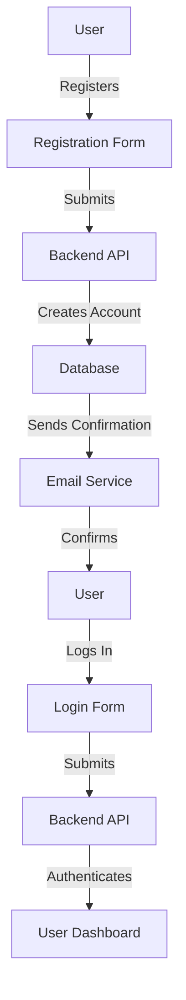
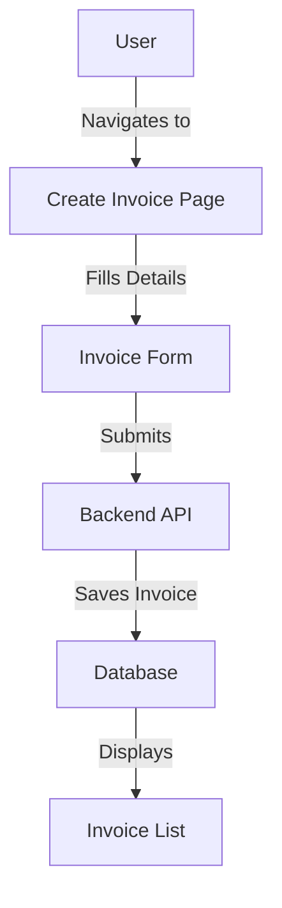
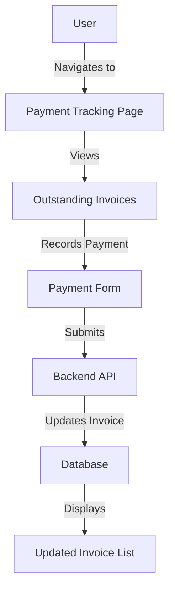

# Invoice Management App Requirements

## Overview
The Invoice Management App is designed to help businesses create, manage, and track invoices efficiently. The app will provide features for generating invoices, sending them to clients, tracking payments, and generating reports.

## Features

### User Management
- User registration and login
- Role-based access control (Admin, User)
- Profile management

### Invoice Creation
- Create new invoices with customizable templates
- Add client details, invoice items, taxes, and discounts
- Save invoices as drafts

### Invoice Management
- Edit and delete invoices
- Duplicate existing invoices
- Search and filter invoices by date, client, status, etc.

### Client Management
- Add and manage client information
- Import and export client data
- Search and filter clients

### Payment Tracking
- Record payments against invoices
- Track outstanding and overdue invoices
- Send payment reminders to clients

### Reporting
- Generate reports on invoices, payments, and clients
- Export reports in PDF and Excel formats
- Dashboard with key metrics and charts

### Notifications
- Email notifications for invoice creation, payment reminders, and overdue invoices
- Customizable email templates

### Integration
- Integration with accounting software (e.g., QuickBooks, Xero)
- API for third-party integrations

### Security
- Data encryption in transit and at rest
- Regular security audits and updates

## User Flow Diagrams

### User Registration and Login

### Invoice Creation

### Payment Tracking

## Non-Functional Requirements
- Responsive design for mobile and desktop
- High availability and scalability
- User-friendly interface
- Performance optimization for fast loading times

## Technology Stack
- Frontend: React.js
- Backend: Node.js, Express.js
- Database: MongoDB
- Authentication: JWT, OAuth
- Deployment: Docker, Kubernetes

## Milestones
- Phase 1: User Management and Authentication
- Phase 2: Invoice Creation and Management
- Phase 3: Client Management and Payment Tracking
- Phase 4: Reporting and Notifications
- Phase 5: Integration and Security

## Conclusion
The Invoice Management App aims to streamline the invoicing process for businesses, providing a comprehensive solution for managing invoices, clients, and payments. By following the outlined requirements, the app will deliver a robust and user-friendly experience.
